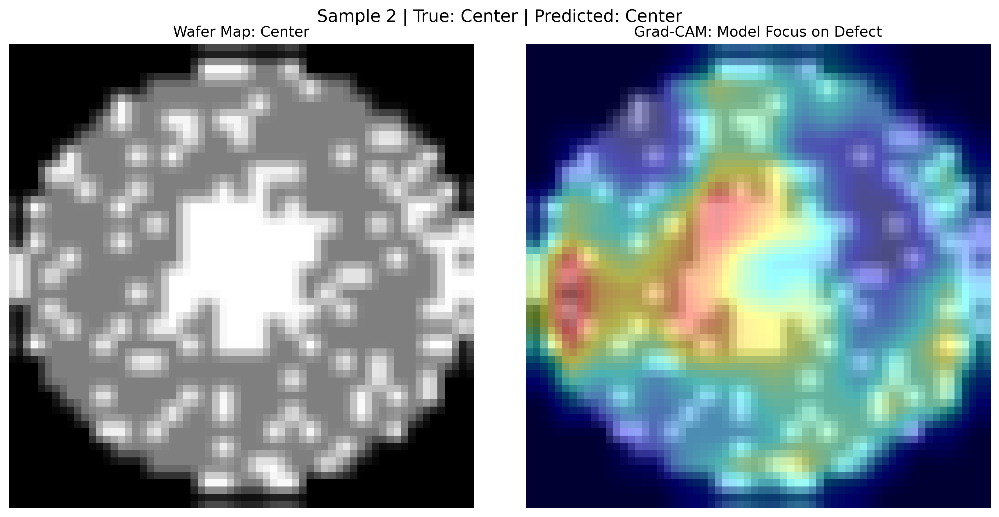
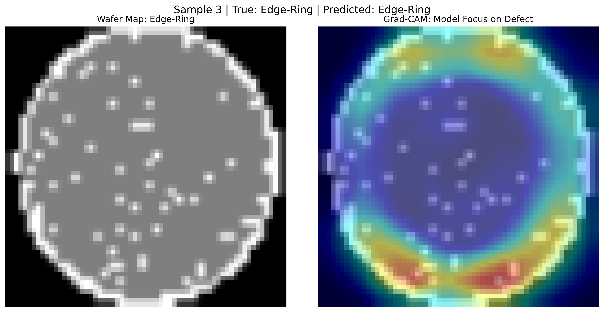

# Wafer Defect Classification: Interpretable Deep Learning for Yield Analysis 🏭

This repository contains the complete, high-performance solution for classifying the eight major defect patterns found on semiconductor wafer maps (WM-811K industrial dataset). The focus is on developing a **robust, memory-efficient, and trustworthy** AI system suitable for manufacturing quality control.

## 2. Project Highlights and Final Performance 🚀

This solution achieves high overall accuracy while ensuring strong performance across rare (minority) defect classes, which is critical for maximizing wafer yield.

| Metric | Initial Baseline (ResNet-18) | **Final Model (Custom CNN + Weighted Loss)** | Improvement |
| :--- | :--- | :--- | :--- |
| **Macro F1-Score** | 0.8288 | $\mathbf{0.8574}$ | **+2.86%** |
| **Overall Accuracy** | 84.64% | $\mathbf{87.48\%}$ | |

### Methodology Innovations

This project demonstrates advanced expertise by solving critical industrial challenges:

1.  **Memory Constraint & Scalability (The Practical Solution):** Implemented a **Custom PyTorch Dataset (Lazy Loading)** to process the heavily oversampled training set ($\text{60k+}$ images) on-the-fly, avoiding $\text{10GB+}$ RAM overhead common with in-memory tensor storage.
2.  **Imbalance Resolution (Performance Maximization):** Employed a dual-strategy approach: **Random Oversampling** to balance training set size, combined with **Weighted Cross-Entropy Loss** to force the model to prioritize learning the features of rare defects.
3.  **Trust & Explainability (The XAI Proof):** Developed a custom, pure PyTorch implementation of the **Grad-CAM** algorithm to generate visual heatmaps, confirming the model is making decisions based on correct geometric/spatial features (e.g., confirming the 'Center' or 'Scratch' pattern is the area of focus).

---

## 3. Detailed Results Breakdown

The success of the weighted loss is shown in the improved performance on difficult classes:

| Defect Class | Precision | Recall | F1-Score | Analysis |
| :--- | :--- | :--- | :--- | :--- |
| `['Loc']`   | **0.91** | 0.45 | 0.60 | High precision but lower recall is the remaining weakness; indicates reliability when predicting 'Loc' but difficulty finding all instances. |
| `['Edge-Loc']`   | 0.84 | 0.91 | 0.88 | Strong balance, high identification rate. |
| `['Center']`   | 0.71 | **0.99** | 0.83 | Excellent recall—the model rarely misses a true 'Center' defect. |
| `['Donut']`   | 0.89 | 0.77 | 0.82 | Significant improvement in F1-score for a historically low-sample class. |

---

## 4. Visual Evidence (Explainable AI - Grad-CAM)

The visualization confirms the model's focus, providing essential diagnostic feedback.

| Wafer Map | Grad-CAM Visualization | Insight |
| :---: | :---: | :--- |
|  |  | **Center Defect:** Heatmap correctly localizes attention to the dense central defect area. |
|  |  | **Edge-Ring Defect:** Attention is focused precisely on the defect ring structure near the wafer boundary. |

**(Note: Please ensure you upload your image files to the `assets/XAI_VISUALS` folder on GitHub and link them correctly.)**

## 5. Repository Structure and Setup

```bash
wafer-defect-xai/
│
├── models/
│   └── custom_wafer_cnn_weighted.pth      # Final trained weights (F1 = 0.8574)
│
├── assets/
│    └── grad_cam_sample_1_Loc.png
│    └── grad_cam_sample_2_Center.png
│    └── grad_cam_sample_3_Edge-Ring.png                      # Folder for all Grad-CAM images (.png)
│
├── Wafer_Defect_Classifier.ipynb          # Clean, executable project notebook
│
└── requirements.txt                       # Python environment dependencies
```


### How to Run the Project

1.  **Clone the Repository:**
    ```bash
    git clone [https://github.com/Jiya-Parmar/wafer-defect-xai.git](https://github.com/Jiya-Parmar/wafer-defect-xai.git)
    cd wafer-defect-xai
    ```
2.  **Install Dependencies:**
    ```bash
    pip install -r requirements.txt
    ```
3.  **Execute:** Open the `Wafer_Defect_Classifier.ipynb` notebook in Google Colab and run all cells. The notebook automatically handles data download, training, and final visualization.

---
